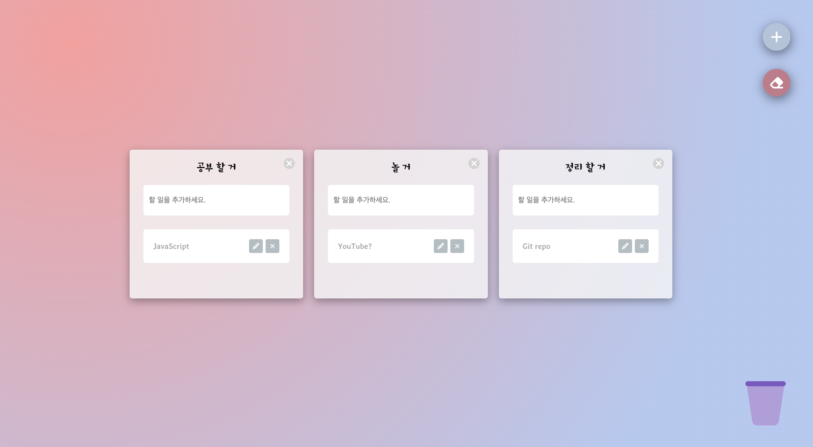

# Trello Clone
React challenge with ReactJS

## 🔗 Demo
https://jonghwa3471.github.io/react-challenge-trello/

## 🖥 Preview

## 🔥 Stack

### Front-end

  

### Deploy

## ✅ Packages

- [x] React
- [x] TypeScript
- [x] Styled-components
- [x] Recoil
- [x] react-beautiful-dnd
- [x] react-hook-form

## 📖 Theory

- [x] Handle State Using Recoil
- [x] Drag and Drop
- [x] Form data handling with react-hook-form
- [x] LocalStorage

## 📱 View

- [x] Home
- [x] Add Board
- [x] Delete Board
- [x] Reorder using Drag and Drop
- [x] Delete ToDo using Drag and Drop
